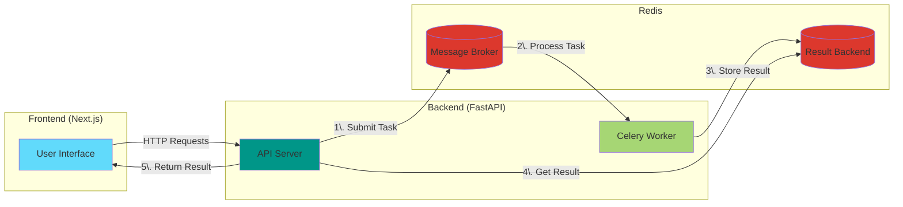

# Celery x Redis - Task Queue

Showcase of Celery x Redis for Task Queue

## System Architecture



## Getting Started

```bash
docker compose up
```

> ### Backend Setup
>
> ```bash
> uv install
> 
> cd backend
> docker compose up
> 
> # http://localhost:8000/
> # http://localhost:8000/docs
> ```
>
> ### Frontend Setup
>
> ```bash
> bun install
> 
> bun dev
> 
> # http://localhost:3000/
> ```

---

## Vibe Coding Guide

Add Documents (`Settings... > Cursor Settings > Features > Docs`):

- https://docs.celeryq.dev/en/stable/
- https://redis-py.readthedocs.io/en/stable/
- https://developer.mozilla.org/en-US/docs/Web
